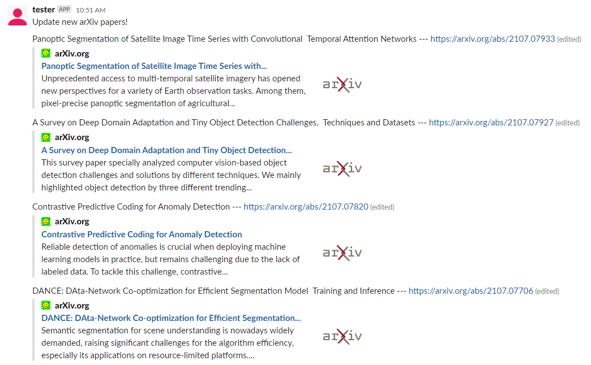

# arXiv-papers-monitoring-bot

Set target keywords. This bot monitors new articles updated on [arxiv.org](https://arxiv.org/) and sends articles including keywords as Slack messages.

## How to use
Build a Slackbot and link it to your Slack channel. Add your slack token to [slack.py](https://github.com/Hydragon516/arXiv-papers-monitoring-bot/blob/main/slack.py).
See [Slacker](https://github.com/os/slacker).
Edit target keywords in [target.txt](https://github.com/Hydragon516/arXiv-papers-monitoring-bot/blob/main/target.txt).

## Example

